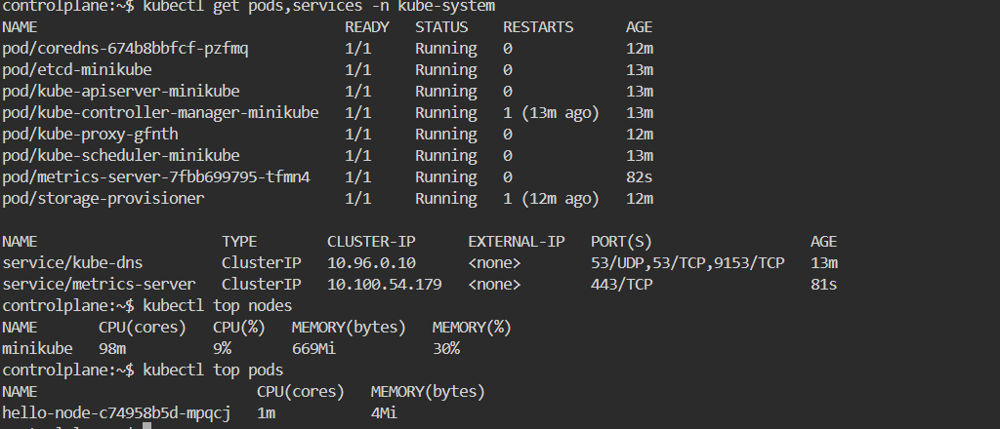

# Reflection

## 1. What is the difference between Rolling Update and Recreate deployment strategy?
Rolling Update is a deployment strategy where the oldest pods are gradually replaced with new ones. During this process, most of the old pods continue running while the new pods are being created, ensuring zero downtime. This strategy is well suited for production environments and is the default deployment method in Kubernetes.

Recreate is a strategy where all existing pods are terminated first before any new pods are created. This results in downtime. It is typically used when updates are not backward-compatible or when dealing with stateful applications that need to be fully recreated. This strategy must be explicitly defined in the deployment manifest.


## 2. Try deploying the Spring Petclinic REST using Recreate deployment strategy and document your attempt.
```bash
kubectl create deployment spring-petclinic-recreate \
  --image=springcommunity/spring-petclinic-rest \
  --dry-run=client -o yaml > recreate-deployment.yaml
```

Edit YAML and Add Recreate Strategy

```yaml
apiVersion: apps/v1
kind: Deployment
metadata:
  creationTimestamp: null
  labels:
    app: spring-petclinic-recreate
  name: spring-petclinic-recreate
spec:
  strategy:
    type: Recreate
  replicas: 1
  selector:
    matchLabels:
      app: spring-petclinic-recreate
  template:
    metadata:
      creationTimestamp: null
      labels:
        app: spring-petclinic-recreate
    spec:
      containers:
      - image: springcommunity/spring-petclinic-rest
        name: spring-petclinic-rest
        resources: {}
status: {}
```

```bash
kubectl apply -f spring-petclinic-recreate-deployment.yaml
```

```bash
kubectl expose deployment spring-petclinic-recreate --type=LoadBalancer --port=9966
```


## 3. Prepare different manifest files for executing Recreate deployment strategy.
Get latest service based on recreate strategy
```bash
kubectl get services/spring-petclinic-recreate -o yaml > spring-petclinic-recreate-service.yaml
```


## 4. What do you think are the benefits of using Kubernetes manifest files? Recall your experience in deploying the app manually and compare it to your experience when deploying the same app by applying the manifest files (i.e., invoking `kubectl apply -f` command) to the cluster.
Manual deployment requires memorizing commands, is prone to typos, and isn't easily repeatable.
With manifests, all configurations are stored in YAML files, making deployments repeatable, easy to apply, and reviewable.
Manual deployments make it hard to roll back or audit changes.
Using manifests allows configurations to be tracked in Git, enabling version history and rollbacks.
Manual deployments often lead to inconsistencies across environments.
Manifests can be reused across clusters, ensuring consistent results.
Manual deployment is hard to integrate into CI/CD pipelines.
Manifests are ideal for automation with GitOps and CI/CD workflows.

Manual deployment is fast for early experimentation, but when the cluster is reset or redeployment is needed in a different environment (e.g., a managed Kubernetes cluster on GCP), using manifests is far more efficient. You just run kubectl apply -f without rewriting any commands.


## 5. (Optional) Do the same tutorial steps, but on a managed Kubernetes cluster (e.g., GCP). You need to provision a Kubernetes cluster on Google Cloud Platform. Then, re-run the tutorial steps (Hello Minikube and Rolling Update) on the remote cluster. Document your attempt and highlight the differences and any issues you encountered.
Saya menggunakan [killercoda kubernetes playground](https://killercoda.com/playgrounds/scenario/kubernetes), perbedaan utamanya adalah penggunaan resource pada server, berbeda dengan saat dijalankan di local dengan setup docker desktop + kubernetes. Keterbatasan VM membuat response time dan URL deployment menjadi lebih lemot dan untuk kasus ini hanya dapat diakses melalui CLI menggunakan command curl. Secara konsep deployment hingga rollback sama saja.





